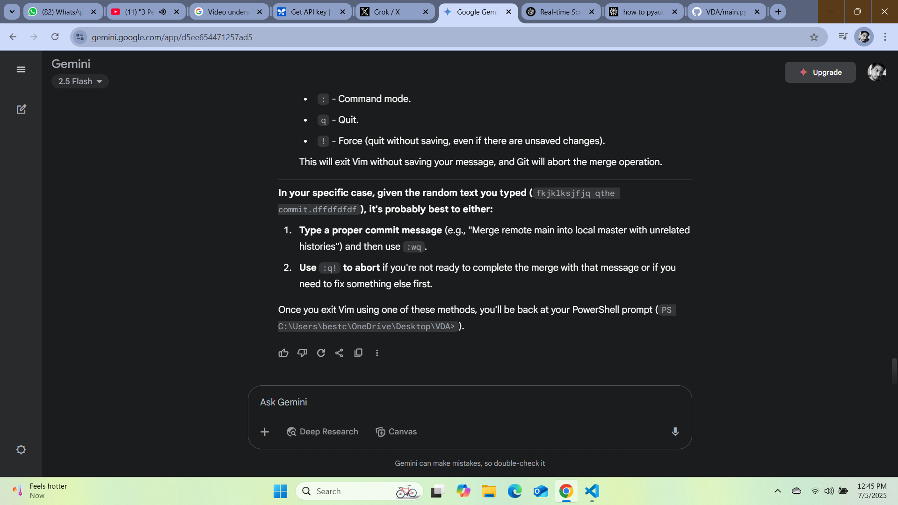

<div align="center">
  

  # 🤖 VDA — Virtual Desktop Assistant
  
  **Your Local, AI-Driven Desktop Companion**

  [](https://www.python.org/downloads/release/python-390/)
  [](https://www.gnu.org/licenses/gpl-3.0)
  [](https://riverbankcomputing.com/software/pyqt/intro)
  [](CONTRIBUTING.md)
  
</div>

---

**VDA (Virtual Desktop Assistant)** is a powerful, locally-run AI assistant designed to control your computer just like a human. It sees your screen, clicks, types, and follows instructions via voice or text. Built natively with Python and PyQt6, VDA features a translucent floating window that stays out of your way while getting work done.

## ✨ Features

- 👁️ **Vision-Based Control**: Uses OpenCV template matching, Windows UI Automation, and **RapidOCR** for pixel-perfect interactions—even when UI templates don't exist!
- 🧠 **Smart Decision Engine**: Powered by an advanced LLM agent loop that re-plans every step based on live screenshots, preventing it from getting stuck or lost.
- ⌨️ **Keyboard & Mouse Synergy**: Smart fallback logic prioritizes robust keyboard shortcuts (e.g., `Ctrl+L`, `Tab`, `Enter`) if UI templates fail.
- 🛠️ **Customizable Skills**: Upload a `desktop_skill.md` file to teach VDA specific workflows, custom UI rules, or standard operating procedures.
- 🌐 **Multi-Provider Support**: Seamlessly integrate with OpenCode Zen, OpenRouter, Gemini, or DeepSeek.

## 🚀 Installation & Setup

### Prerequisites
- **OS**: Windows is highly recommended for the full feature set (especially Windows UI Automation).
- **Python**: Version 3.9 or higher.

### Quick Start

1. **Clone the repository:**
   ```bash
   git clone https://github.com/PCJIRON/VDA.git
   cd VDA
   ```

2. **Install dependencies:**
   ```bash
   cd qwen-desktop
   pip install -r requirements.txt
   ```
   > *Note: VDA relies on native modules like `pyautogui`, `opencv-python`, and `rapidocr-onnxruntime`. Make sure your build tools are up to date.*

3. **Launch VDA:**
   ```bash
   python run.py
   ```

## ⚙️ Configuration

Settings are saved locally in a `.json` file. Through the settings menu, you can configure:
- 🤖 Your preferred AI model and API provider.
- 🔗 API Base URLs and credentials.
- 📜 The path to your custom `desktop_skill.md` file to supercharge your assistant.

## 🤝 Contributing

We love contributions! If you'd like to help improve VDA, please check out our [Contributing Guidelines](CONTRIBUTING.md).

1. Fork the Project
2. Create your Feature Branch (`git checkout -b feature/AmazingFeature`)
3. Commit your Changes (`git commit -m 'Add some AmazingFeature'`)
4. Push to the Branch (`git push origin feature/AmazingFeature`)
5. Open a Pull Request

## 📄 License

This project is licensed under the **GNU General Public License v3.0**. See the [LICENSE](LICENSE) file for details.

---
<div align="center">
  <i>Built with ❤️ for desktop automation.</i>
</div>
